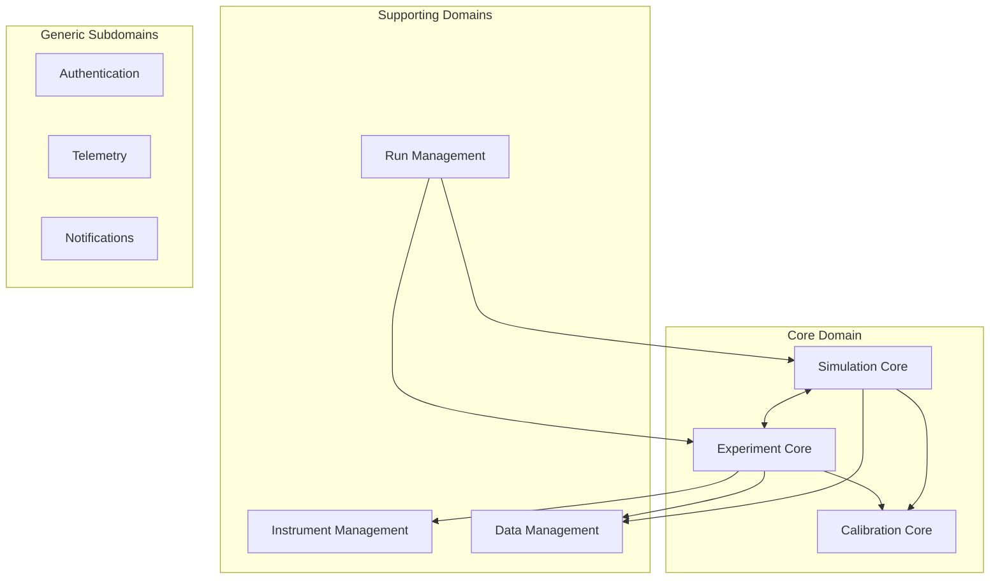

# Galvana System Design & Architecture

## Executive Vision

Galvana represents the convergence of computational physics and physical instrumentation, creating a **phygital twin architecture** where simulations and experiments are seamlessly interchangeable. Our long-term vision positions Galvana as the **Bloomberg Terminal of Electrochemistry** - the definitive platform for electrochemical R&D and manufacturing decisions.

## Domain-Driven Design

### Bounded Contexts



### Core Domain Models

#### 1. Simulation Context

```typescript
// Aggregate Root
class SimulationAggregate {
    readonly id: SimulationId;
    private scenario: Scenario;
    private physicsEngine: PhysicsEngine;
    private state: SimulationState;
    private history: Event[];
    
    // Domain Events
    onSimulationStarted: DomainEvent<SimulationStartedPayload>;
    onTimeStepCompleted: DomainEvent<TimeStepPayload>;
    onSimulationCompleted: DomainEvent<SimulationCompletedPayload>;
    
    // Commands
    start(params: SimulationParams): Result<void>;
    pause(): Result<void>;
    resume(): Result<void>;
    abort(reason: string): Result<void>;
    
    // Invariants
    private validatePhysicsConsistency(): boolean;
    private ensureConservationLaws(): boolean;
}

// Value Objects
class PhysicsConfiguration {
    readonly transport: TransportModel;
    readonly kinetics: KineticsModel;
    readonly thermodynamics: ThermodynamicsModel;
    
    static fromYAML(yaml: string): Result<PhysicsConfiguration>;
    
    // Smart defaults based on material system
    withIntelligentDefaults(): PhysicsConfiguration;
}

// Domain Services
interface SimulationEngine {
    solve(config: PhysicsConfiguration, mesh: Mesh): AsyncIterator<SolutionFrame>;
    validateStability(solution: Solution): StabilityMetrics;
}
```

#### 2. Experiment Context

```typescript
// Aggregate Root
class ExperimentAggregate {
    readonly id: ExperimentId;
    private instrument: InstrumentConnection;
    private protocol: ExperimentProtocol;
    private dataStream: DataStream;
    private safetyInterlocks: SafetySystem;
    
    // Domain Events
    onExperimentStarted: DomainEvent<ExperimentStartedPayload>;
    onDataFrameReceived: DomainEvent<DataFramePayload>;
    onSafetyTriggered: DomainEvent<SafetyEventPayload>;
    
    // Commands with safety checks
    async start(protocol: Protocol): Result<void> {
        await this.safetyInterlocks.verify();
        // ...
    }
    
    emergencyStop(): void {
        this.safetyInterlocks.trigger();
        this.instrument.immediateStop();
    }
}

// Hardware Abstraction Layer
interface InstrumentDriver {
    connect(config: ConnectionConfig): Promise<Connection>;
    program(waveform: Waveform): Promise<void>;
    stream(): AsyncIterator<InstrumentFrame>;
    
    // Vendor-agnostic capabilities
    readonly capabilities: InstrumentCapabilities;
    readonly latency: LatencyProfile;
}
```

#### 3. Calibration Context

```typescript
// Aggregate Root
class CalibrationAggregate {
    readonly id: CalibrationId;
    private model: PhysicsModel;
    private experimental: Dataset;
    private optimizer: Optimizer;
    
    // Bayesian calibration with uncertainty quantification
    calibrate(): CalibrationResult {
        const prior = this.model.getPriors();
        const likelihood = this.computeLikelihood();
        const posterior = this.optimizer.sample(prior, likelihood);
        
        return {
            parameters: posterior.map,
            uncertainty: posterior.credibleIntervals,
            diagnostics: this.validateConvergence()
        };
    }
    
    // Active learning for optimal experiment design
    suggestNextExperiment(): ExperimentDesign {
        const informationGain = this.computeExpectedInformationGain();
        return this.optimizer.maximizeInformation(informationGain);
    }
}
```

## API Architecture

### REST API Design (OpenAPI 3.1)

```yaml
openapi: 3.1.0
info:
  title: Galvana API
  version: 1.0.0

paths:
  /api/v1/runs:
    post:
      summary: Start simulation or experiment
      requestBody:
        content:
          application/json:
            schema:
              oneOf:
                - $ref: '#/components/schemas/SimulationRequest'
                - $ref: '#/components/schemas/ExperimentRequest'
      responses:
        '202':
          description: Run accepted
          content:
            application/json:
              schema:
                $ref: '#/components/schemas/RunHandle'
          headers:
            Location:
              schema:
                type: string
                example: /api/v1/runs/run_abc123
            X-Estimated-Duration:
              schema:
                type: integer
                example: 120
        '400':
          $ref: '#/components/responses/ValidationError'
        '503':
          $ref: '#/components/responses/ResourcesUnavailable'

  /api/v1/runs/{runId}/stream:
    get:
      summary: Stream run data
      parameters:
        - name: runId
          in: path
          required: true
          schema:
            type: string
        - name: channels
          in: query
          schema:
            type: array
            items:
              type: string
              enum: [status, frames, logs, events]
      responses:
        '200':
          description: SSE stream
          content:
            text/event-stream:
              schema:
                type: string

components:
  schemas:
    SimulationRequest:
      type: object
      required: [scenario, engine]
      properties:
        scenario:
          oneOf:
            - $ref: '#/components/schemas/ScenarioYAML'
            - $ref: '#/components/schemas/ScenarioId'
        engine:
          type: string
          enum: [auto, fenicsx, moose]
        compute:
          $ref: '#/components/schemas/ComputeRequirements'
        callbacks:
          type: array
          items:
            $ref: '#/components/schemas/Webhook'
```

### GraphQL Schema (Federation-Ready)

```graphql
# Federated schema for microservices
extend schema
  @link(url: "https://specs.apollo.dev/federation/v2.3")

type Run @key(fields: "id") {
  id: ID!
  type: RunType!
  status: RunStatus!
  scenario: Scenario!
  
  # Real-time subscriptions
  frames: [Frame!]! @stream
  events: [Event!]! @stream
  
  # Computed fields
  progress: Progress!
  estimatedCompletion: DateTime
  
  # Federation
  instrument: Instrument @provides(fields: "status")
  datasets: [Dataset!]! @external
}

type Subscription {
  runUpdates(runId: ID!): RunUpdate!
  instrumentTelemetry(instrumentId: ID!): InstrumentTelemetry!
}

# Federated resolver
directive @computed(
  dependsOn: [String!]!
) on FIELD_DEFINITION

type SimulationResult {
  convergence: ConvergenceMetrics! @computed(dependsOn: ["frames"])
  conservationErrors: ConservationMetrics! @computed(dependsOn: ["solution"])
}
```

## Event-Driven Architecture

### Event Sourcing & CQRS

```typescript
// Event Store
interface EventStore {
    append(streamId: string, events: DomainEvent[]): Promise<void>;
    read(streamId: string, fromVersion?: number): AsyncIterator<DomainEvent>;
    subscribe(pattern: string): EventSubscription;
}

// Command Handler
class RunCommandHandler {
    constructor(
        private eventStore: EventStore,
        private projections: ProjectionStore
    ) {}
    
    async handle(command: StartRunCommand): Promise<Result<RunId>> {
        // Validate command
        const validation = await this.validate(command);
        if (validation.isFailure) return validation;
        
        // Create aggregate
        const run = Run.create(command);
        
        // Persist events
        await this.eventStore.append(run.id, run.uncommittedEvents);
        
        // Update read model asynchronously
        this.projections.update(run.id, run.state);
        
        return Result.ok(run.id);
    }
}

// Event Processors
class RunProjection {
    @EventHandler(RunStarted)
    async onRunStarted(event: RunStarted): Promise<void> {
        await this.db.runs.insert({
            id: event.runId,
            status: 'started',
            startedAt: event.timestamp
        });
    }
    
    @EventHandler(FrameComputed)
    async onFrameComputed(event: FrameComputed): Promise<void> {
        // Update materialized view
        await this.timeseries.append(event.runId, event.frame);
        
        // Trigger downstream analytics
        await this.analytics.process(event);
    }
}
```

### Message Bus Architecture

```typescript
// Domain Event Bus with Outbox Pattern
class DomainEventBus {
    constructor(
        private outbox: TransactionalOutbox,
        private publisher: MessagePublisher
    ) {}
    
    async publish(events: DomainEvent[], tx: Transaction): Promise<void> {
        // Store in outbox within transaction
        await this.outbox.store(events, tx);
        
        // Async publish with retry
        setImmediate(() => this.publishFromOutbox());
    }
    
    private async publishFromOutbox(): Promise<void> {
        const pending = await this.outbox.getPending();
        
        for (const batch of this.batch(pending, 100)) {
            await Promise.allSettled(
                batch.map(event => this.publisher.publish(event))
            );
            await this.outbox.markPublished(batch.map(e => e.id));
        }
    }
}

// Integration Events (Anti-Corruption Layer)
class IntegrationEventAdapter {
    @Subscribe('simulation.completed')
    async onSimulationCompleted(event: SimulationCompleted): Promise<void> {
        // Transform domain event to integration event
        const integrationEvent = {
            type: 'RunCompleted',
            runId: event.aggregateId,
            results: this.mapResults(event.results),
            timestamp: event.occurredAt
        };
        
        // Publish to external systems
        await this.kafka.send('galvana.runs', integrationEvent);
    }
}
```

## Scalability Patterns

### 1. Compute Orchestration

```typescript
// Adaptive Resource Allocation
class ComputeOrchestrator {
    private scheduler: JobScheduler;
    private predictor: ResourcePredictor;
    
    async scheduleRun(run: Run): Promise<JobHandle> {
        // Predict resource needs
        const resources = await this.predictor.predict({
            meshSize: run.scenario.mesh.elements,
            timeSteps: run.scenario.estimatedSteps,
            physics: run.scenario.physics
        });
        
        // Find optimal placement
        const placement = await this.scheduler.findOptimal({
            cpu: resources.cpu,
            memory: resources.memory,
            gpu: resources.gpu,
            affinity: this.getAffinity(run)
        });
        
        // Schedule with autoscaling
        return this.scheduler.schedule({
            job: run.toJob(),
            placement,
            scaling: {
                min: 1,
                max: 10,
                metric: 'queue_depth',
                threshold: 0.7
            }
        });
    }
}

// Distributed Simulation with Domain Decomposition
class DistributedSimulation {
    async solve(scenario: Scenario): AsyncIterator<SolutionFrame> {
        // Partition domain
        const partitions = this.partitioner.partition(
            scenario.mesh,
            this.availableNodes()
        );
        
        // Create MPI communicator
        const comm = await MPI.init(partitions.length);
        
        // Solve in parallel
        const solvers = partitions.map((part, rank) => 
            this.createSolver(part, comm, rank)
        );
        
        // Stream aggregated results
        yield* this.aggregateStreams(solvers);
    }
}
```

### 2. Data Pipeline

```typescript
// Time-Series Optimization
class TimeSeriesStore {
    private hot: RedisTimeSeries;
    private warm: TimescaleDB;
    private cold: S3Storage;
    
    async write(frame: DataFrame): Promise<void> {
        // Write to hot storage
        await this.hot.append(frame.runId, frame);
        
        // Async tiering
        this.scheduleCompaction(frame.runId);
    }
    
    async query(query: TimeSeriesQuery): Promise<DataFrames> {
        // Query router based on time range
        if (query.isRecent()) {
            return this.hot.query(query);
        } else if (query.isWarm()) {
            return this.warm.query(query);
        } else {
            return this.cold.query(query);
        }
    }
}

// Field Data Optimization
class FieldDataStore {
    async store(field: FieldData): Promise<void> {
        // Compress with Zarr
        const compressed = await zarr.compress(field, {
            chunks: this.optimalChunks(field),
            compressor: 'blosc',
            dtype: field.precision
        });
        
        // Store with spatial indexing
        await this.s3.put(compressed, {
            metadata: {
                bounds: field.bounds,
                resolution: field.resolution,
                index: this.spatialIndex(field)
            }
        });
    }
}
```

### 3. Streaming Architecture

```typescript
// Backpressure-Aware Streaming
class StreamingPipeline {
    private buffer: CircularBuffer<Frame>;
    private backpressure: BackpressureController;
    
    async *stream(source: AsyncIterator<Frame>): AsyncIterator<Frame> {
        for await (const frame of source) {
            // Check backpressure
            if (this.backpressure.shouldThrottle()) {
                await this.backpressure.wait();
            }
            
            // Adaptive batching
            this.buffer.add(frame);
            
            if (this.buffer.shouldFlush()) {
                yield* this.buffer.flush();
            }
        }
    }
}

// WebSocket with Graceful Degradation
class AdaptiveWebSocket {
    async connect(client: Client): Promise<Connection> {
        // Try WebSocket
        try {
            return await this.websocket.connect(client);
        } catch (e) {
            // Fallback to SSE
            try {
                return await this.sse.connect(client);
            } catch (e) {
                // Final fallback to long polling
                return await this.longPoll.connect(client);
            }
        }
    }
}
```

## Resilience Patterns

### 1. Circuit Breaker with Adaptive Thresholds

```typescript
class AdaptiveCircuitBreaker {
    private stats: SlidingWindow<RequestStats>;
    private threshold: AdaptiveThreshold;
    
    async execute<T>(fn: () => Promise<T>): Promise<T> {
        if (this.isOpen()) {
            if (this.shouldAttemptReset()) {
                return this.tryHalfOpen(fn);
            }
            throw new CircuitOpenError();
        }
        
        try {
            const result = await fn();
            this.recordSuccess();
            return result;
        } catch (error) {
            this.recordFailure(error);
            
            // Adaptive threshold based on error patterns
            if (this.threshold.shouldOpen(this.stats)) {
                this.open();
            }
            
            throw error;
        }
    }
}
```

### 2. Bulkhead Isolation

```typescript
class BulkheadIsolation {
    private pools: Map<ServiceType, WorkerPool>;
    
    async execute(service: ServiceType, task: Task): Promise<Result> {
        const pool = this.pools.get(service);
        
        if (pool.isFull()) {
            // Shed load or queue with timeout
            if (task.priority === Priority.HIGH) {
                return pool.queueWithTimeout(task, 5000);
            } else {
                throw new ServiceOverloadedError();
            }
        }
        
        return pool.execute(task);
    }
}
```

### 3. Saga Pattern for Distributed Transactions

```typescript
class RunSaga {
    private steps: SagaStep[] = [
        new ValidateScenarioStep(),
        new AllocateResourcesStep(),
        new InitializeSimulationStep(),
        new StreamResultsStep()
    ];
    
    async execute(context: RunContext): Promise<Result> {
        const executed: SagaStep[] = [];
        
        try {
            for (const step of this.steps) {
                await step.execute(context);
                executed.push(step);
            }
            return Result.success(context);
        } catch (error) {
            // Compensate in reverse order
            for (const step of executed.reverse()) {
                await step.compensate(context).catch(console.error);
            }
            return Result.failure(error);
        }
    }
}
```

## Security Architecture

### Zero-Trust Security Model

```typescript
// Policy-Based Access Control
class PolicyEngine {
    async authorize(request: Request): Promise<Decision> {
        const policies = await this.loadPolicies(request.context);
        
        // Evaluate all applicable policies
        const decisions = await Promise.all(
            policies.map(p => this.evaluate(p, request))
        );
        
        // Combine decisions (deny overrides)
        return this.combineDecisions(decisions);
    }
    
    private async evaluate(policy: Policy, request: Request): Promise<Decision> {
        // Attribute-based evaluation
        const attributes = await this.collectAttributes(request);
        
        return policy.evaluate({
            subject: attributes.subject,
            resource: attributes.resource,
            action: request.action,
            environment: attributes.environment
        });
    }
}

// End-to-end encryption for sensitive data
class EncryptionService {
    async encryptField(field: SensitiveField): Promise<EncryptedField> {
        // Field-level encryption with key rotation
        const dataKey = await this.kms.generateDataKey();
        const encrypted = await this.encrypt(field.value, dataKey.plaintext);
        
        return {
            ciphertext: encrypted,
            keyId: dataKey.keyId,
            algorithm: 'AES-256-GCM',
            rotation: this.rotationSchedule
        };
    }
}
```

## Implementation Roadmap

### Phase 1: Foundation (Months 1-3)
- Core domain models and aggregates
- Event sourcing infrastructure
- Basic REST API with OpenAPI spec
- FEniCSx simulation engine integration
- PostgreSQL + Redis + S3 setup

### Phase 2: Streaming & Real-time (Months 4-6)
- WebSocket streaming with backpressure
- Event-driven architecture with Kafka/NATS
- Time-series data optimization
- HAL for Gamry/BioLogic instruments
- GraphQL federation setup

### Phase 3: Intelligence & Scale (Months 7-9)
- Bayesian calibration engine
- Distributed simulation with MPI
- Adaptive resource allocation
- ML-based parameter prediction
- Advanced resilience patterns

### Phase 4: Enterprise & Ecosystem (Months 10-12)
- Multi-tenancy with isolation
- Advanced RBAC/ABAC policies
- Marketplace for simulation templates
- Plugin architecture for custom physics
- Comprehensive audit & compliance

## Technology Stack

### Core Technologies
```yaml
frontend:
  framework: Next.js 14 with App Router
  state: Zustand + React Query
  realtime: Socket.io Client
  charts: D3.js + Visx
  3d: Three.js for morphology visualization

backend:
  api: FastAPI with Pydantic 2
  async: Python 3.11+ with AsyncIO
  workers: Celery with Redis
  streaming: Kafka Streams / NATS JetStream

simulation:
  fenicsx: FEniCSx 0.7+ with PETSc
  moose: MOOSE Framework
  mesh: Gmsh + PyGmsh
  solvers: PETSc + SUNDIALS

data:
  oltp: PostgreSQL 15+ with TimescaleDB
  olap: ClickHouse for analytics
  cache: Redis 7+ with RedisTimeSeries
  objects: S3-compatible (MinIO/R2)
  search: Elasticsearch for logs

infrastructure:
  orchestration: Kubernetes with Istio
  ci/cd: GitHub Actions + ArgoCD
  monitoring: Prometheus + Grafana + Loki
  tracing: OpenTelemetry + Jaeger
```

## Success Metrics

### Technical KPIs
- P99 API latency < 100ms
- Simulation throughput > 1M timesteps/sec
- Stream latency < 50ms @ 50Hz
- Zero data loss for committed frames
- 99.99% uptime for critical paths

### Business KPIs
- Time to first simulation < 2 minutes
- Parameter calibration accuracy > 95%
- User session length > 30 minutes
- API adoption rate > 60% of users
- Enterprise customer retention > 90%

## Innovation Vectors

### Near-term (6 months)
- Physics-informed neural networks for surrogate modeling
- Automated experiment design via active learning
- Real-time collaboration on simulations
- Visual programming for scenario building

### Long-term (2+ years)
- Quantum computing for molecular dynamics
- Digital twin synchronization with manufacturing
- Autonomous lab integration
- Blockchain-based result certification