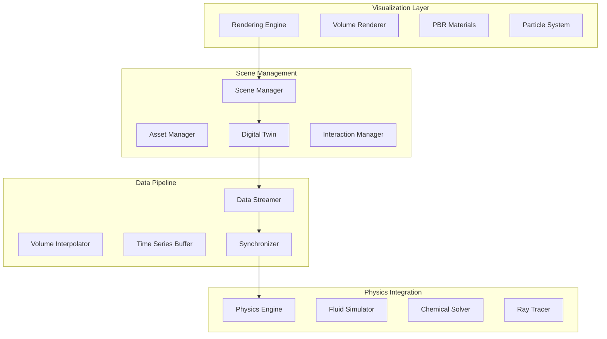

# Galvana 3D Visualization Architecture

## Executive Summary

A comprehensive volumetric visualization system that creates an immersive digital twin of electrochemistry laboratories, enabling real-time visualization of experiments, instruments, and molecular-level processes with photorealistic rendering and physics-accurate simulations.

## System Architecture

### Core Components



## Domain Model

### Laboratory Environment

```typescript
// Core spatial domain
namespace LabEnvironment {
  
  class Laboratory {
    id: string
    name: string
    layout: LabLayout
    workbenches: Workbench[]
    instruments: Instrument[]
    storage: ChemicalStorage[]
    lighting: LightingSystem
    ventilation: VentilationSystem
    safety: SafetyEquipment[]
    
    async loadEnvironment(): Promise<void>
    updateLighting(config: LightingConfig): void
    simulateAirflow(): FlowField
  }
  
  class Workbench {
    id: string
    position: Vector3
    dimensions: BoundingBox
    surface: Material
    slots: EquipmentSlot[]
    powerOutlets: PowerOutlet[]
    gasLines: GasLine[]
    
    placeEquipment(equipment: Equipment, slot: EquipmentSlot): void
    connectPower(device: PoweredDevice): Connection
    validatePlacement(equipment: Equipment): ValidationResult
  }
  
  class EquipmentSlot {
    id: string
    position: Vector3
    size: SlotSize
    type: SlotType // standard, fume_hood, balance_table
    occupied: boolean
    constraints: PlacementConstraints
    
    canAccept(equipment: Equipment): boolean
    mount(equipment: Equipment): MountPoint[]
  }
}
```

### Instrument Digital Twins

```typescript
namespace Instruments {
  
  abstract class Instrument {
    id: string
    model: string
    manufacturer: string
    digitalTwin: DigitalTwin
    realTimeData: DataStream
    calibration: CalibrationData
    
    abstract render(): Object3D
    abstract animate(deltaTime: number): void
    abstract bindToRealInstrument(connection: InstrumentConnection): void
  }
  
  class Potentiostat extends Instrument {
    electrodes: Electrode[]
    cell: ElectrochemicalCell
    display: DisplayPanel
    controls: ControlPanel
    
    render(): Object3D {
      return new PotentiostatModel({
        baseUnit: this.loadModel('potentiostat_base.gltf'),
        display: this.createDisplay(),
        cables: this.createCables(),
        indicators: this.createLEDIndicators()
      })
    }
    
    visualizeCurrent(current: number): void {
      this.display.updateGraph(current)
      this.animateElectronFlow(current)
    }
    
    animateElectronFlow(current: number): void {
      // Particle system showing electron flow
      this.particleSystem.emit({
        rate: Math.abs(current) * 1000,
        velocity: current > 0 ? Vector3.UP : Vector3.DOWN,
        color: current > 0 ? 0x00ff00 : 0xff0000
      })
    }
  }
  
  class ElectrochemicalCell extends Instrument {
    geometry: CellGeometry
    electrodes: Electrode[]
    electrolyte: Electrolyte
    temperature: number
    agitation: AgitationSystem
    
    renderElectrolyte(): VolumeData {
      return new VolumeData({
        dimensions: this.geometry.innerVolume,
        scalarField: this.electrolyte.concentrationField,
        colorMap: 'viridis',
        opacity: 0.7
      })
    }
    
    visualizeConcentration(species: Species): void {
      const field = this.electrolyte.getConcentrationField(species)
      this.volumeRenderer.update(field)
    }
    
    visualizeDeposition(rate: number, position: Vector3): void {
      this.depositionSystem.addLayer({
        thickness: rate * deltaTime,
        position: position,
        material: this.getMaterial(),
        morphology: this.calculateMorphology()
      })
    }
  }
  
  class DigitalTwin {
    physicalDevice: DeviceConnection
    virtualModel: Object3D
    sensorData: SensorStream[]
    actuators: Actuator[]
    synchronizer: TwinSynchronizer
    
    async syncWithPhysical(): Promise<void> {
      const state = await this.physicalDevice.getState()
      this.virtualModel.updateState(state)
      this.validateSync()
    }
    
    predictBehavior(input: Input): Prediction {
      return this.mlModel.predict({
        currentState: this.virtualModel.state,
        input: input,
        history: this.sensorData.getHistory()
      })
    }
  }
}
```

### Volumetric Visualization

```typescript
namespace VolumetricRendering {
  
  class VolumeRenderer {
    technique: RenderingTechnique // ray_marching, texture_slicing, splatting
    resolution: Vector3
    bounds: BoundingBox
    transferFunction: TransferFunction
    
    render(volumeData: VolumeData, camera: Camera): Texture {
      switch(this.technique) {
        case 'ray_marching':
          return this.rayMarch(volumeData, camera)
        case 'texture_slicing':
          return this.textureSlice(volumeData, camera)
        case 'splatting':
          return this.splat(volumeData, camera)
      }
    }
    
    private rayMarch(volume: VolumeData, camera: Camera): Texture {
      const shader = new RayMarchingShader({
        volumeTexture: volume.to3DTexture(),
        transferFunction: this.transferFunction,
        stepSize: this.calculateStepSize(),
        earlyTermination: 0.95
      })
      
      return this.gpuRenderer.render(shader, camera)
    }
  }
  
  class ConcentrationField {
    grid: Float32Array
    dimensions: Vector3
    spacing: Vector3
    species: Species[]
    
    interpolate(position: Vector3): number {
      // Trilinear interpolation for smooth visualization
      const gridPos = this.worldToGrid(position)
      return this.trilinearInterpolate(gridPos)
    }
    
    generateIsoSurface(threshold: number): Mesh {
      // Marching cubes for concentration boundaries
      return new MarchingCubes({
        field: this.grid,
        dimensions: this.dimensions,
        threshold: threshold
      }).generateMesh()
    }
    
    advect(velocity: VectorField, dt: number): void {
      // Semi-Lagrangian advection for fluid motion
      this.grid = this.semiLagrangianAdvection(velocity, dt)
    }
  }
  
  class MaterialVisualizer {
    pbrMaterials: Map<string, PBRMaterial>
    substanceLibrary: SubstanceLibrary
    
    visualizeMolecule(molecule: Molecule): Object3D {
      const group = new Group()
      
      // Ball-and-stick model
      molecule.atoms.forEach(atom => {
        const sphere = new Mesh(
          new SphereGeometry(atom.radius * 0.3),
          this.getAtomMaterial(atom)
        )
        sphere.position.copy(atom.position)
        group.add(sphere)
      })
      
      // Bonds
      molecule.bonds.forEach(bond => {
        const cylinder = this.createBond(bond)
        group.add(cylinder)
      })
      
      // Electron density (optional)
      if (molecule.electronDensity) {
        const density = new VolumeRenderer().render(
          molecule.electronDensity
        )
        group.add(density)
      }
      
      return group
    }
    
    private getAtomMaterial(atom: Atom): Material {
      return new MeshPhysicalMaterial({
        color: ELEMENT_COLORS[atom.element],
        metalness: atom.metalness || 0.1,
        roughness: 0.3,
        clearcoat: 0.5,
        clearcoatRoughness: 0.1,
        envMapIntensity: 1.0
      })
    }
  }
  
  class FluidRenderer {
    method: FluidRenderMethod // SPH, grid_based, hybrid
    particles: ParticleSystem
    surface: SurfaceReconstructor
    
    renderFluid(fluid: FluidSimulation): Object3D {
      // Smoothed Particle Hydrodynamics visualization
      const positions = fluid.getParticlePositions()
      const velocities = fluid.getParticleVelocities()
      
      // Reconstruct surface from particles
      const mesh = this.surface.reconstruct(positions)
      
      // Apply fluid material
      mesh.material = new FluidMaterial({
        color: fluid.color,
        transparency: fluid.transparency,
        viscosity: fluid.viscosity,
        ior: fluid.indexOfRefraction,
        absorption: fluid.absorption
      })
      
      // Add bubbles and turbulence
      this.addBubbles(fluid.getBubbles())
      this.addTurbulence(velocities)
      
      return mesh
    }
  }
}
```

### Real-time Data Integration

```typescript
namespace DataIntegration {
  
  class SimulationVisualizer {
    simulation: SimulationEngine
    renderer: VolumeRenderer
    synchronizer: DataSynchronizer
    interpolator: TemporalInterpolator
    
    async visualizeTimeStep(step: TimeStep): Promise<void> {
      // Get simulation data
      const data = await this.simulation.getFrameData(step)
      
      // Interpolate between frames for smooth animation
      const interpolated = this.interpolator.interpolate(
        this.previousFrame,
        data,
        this.interpolationFactor
      )
      
      // Update concentration fields
      this.updateConcentrationField(interpolated.concentrations)
      
      // Update current flow
      this.visualizeCurrentDensity(interpolated.currentDensity)
      
      // Update deposition
      this.updateDeposition(interpolated.deposition)
      
      // Animate particles
      this.animateIons(interpolated.ionPositions)
    }
    
    private visualizeCurrentDensity(field: ScalarField): void {
      // Streamlines for current flow
      const streamlines = new StreamlineGenerator({
        field: field,
        seedPoints: this.generateSeedPoints(),
        maxLength: 100,
        stepSize: 0.01
      }).generate()
      
      streamlines.forEach(line => {
        const tube = new TubeGeometry(line, 64, 0.001, 8)
        const mesh = new Mesh(tube, this.currentMaterial)
        this.scene.add(mesh)
      })
    }
    
    private animateIons(ions: Ion[]): void {
      this.ionSystem.update(ions.map(ion => ({
        position: ion.position,
        velocity: ion.velocity,
        charge: ion.charge,
        species: ion.species,
        color: this.getIonColor(ion.species),
        size: this.getIonSize(ion.species)
      })))
    }
  }
  
  class RealTimeStreamer {
    websocket: WebSocket
    buffer: RingBuffer<FrameData>
    playbackSpeed: number
    latencyCompensation: LatencyCompensator
    
    async stream(runId: string): AsyncIterator<FrameData> {
      await this.connect(runId)
      
      while (this.websocket.readyState === WebSocket.OPEN) {
        const frame = await this.receiveFrame()
        
        // Compensate for network latency
        const adjusted = this.latencyCompensation.adjust(frame)
        
        // Buffer for smooth playback
        this.buffer.push(adjusted)
        
        // Yield interpolated frame
        yield this.getInterpolatedFrame()
      }
    }
  }
}
```

### Advanced Rendering Features

```typescript
namespace AdvancedRendering {
  
  class PhotorealisticRenderer {
    rayTracer: RayTracer
    pathTracer: PathTracer
    denoisier: Denoiser
    
    renderHighQuality(scene: Scene): Texture {
      // Path traced global illumination
      const rawRender = this.pathTracer.render(scene, {
        samples: 1024,
        maxBounces: 8,
        russianRoulette: 0.95
      })
      
      // AI denoising
      return this.denoisier.denoise(rawRender)
    }
    
    renderCaustics(fluid: Fluid, light: Light): Texture {
      // Photon mapping for caustics
      const photonMap = new PhotonMapper({
        photons: 1_000_000,
        radius: 0.01,
        maxDepth: 10
      })
      
      return photonMap.render(fluid, light)
    }
  }
  
  class SubsurfaceScattering {
    technique: SSSMethod // dipole, multipole, path_traced
    
    render(material: TranslucentMaterial): Shader {
      return new SubsurfaceScatteringShader({
        albedo: material.albedo,
        thickness: material.thickness,
        absorption: material.absorption,
        scattering: material.scattering,
        anisotropy: material.anisotropy
      })
    }
  }
  
  class VolumetricEffects {
    renderSmoke(density: ScalarField): Object3D {
      return new VolumetricSmoke({
        density: density,
        absorption: 0.1,
        scattering: 0.9,
        phase: new HenyeyGreenstein(0.3)
      })
    }
    
    renderFog(density: number): void {
      this.scene.fog = new ExponentialFog({
        color: 0xffffff,
        density: density,
        scattering: true
      })
    }
    
    renderGodRays(light: DirectionalLight): void {
      this.postProcessor.addPass(new GodRayPass({
        light: light,
        samples: 100,
        density: 0.5,
        decay: 0.95
      }))
    }
  }
}
```

## Implementation Architecture

### Scene Graph Structure

```typescript
class LabScene {
  root: Object3D
  
  structure: {
    room: Room
    workbenches: Workbench[]
    storage: Storage[]
    safety: SafetyEquipment[]
  }
  
  equipment: {
    instruments: Map<string, Instrument>
    glassware: Glassware[]
    tools: LabTool[]
  }
  
  experiments: {
    active: Experiment[]
    samples: Sample[]
    reactions: ChemicalReaction[]
  }
  
  visualization: {
    concentrationFields: VolumeData[]
    flowFields: VectorField[]
    particles: ParticleSystem[]
  }
  
  lighting: {
    ambient: AmbientLight
    overhead: Light[]
    task: Light[]
    emergency: Light[]
  }
}
```

### Asset Pipeline

```typescript
class AssetManager {
  modelLoader: GLTFLoader
  textureLoader: TextureLoader
  materialLibrary: MaterialLibrary
  
  async loadLabEnvironment(): Promise<Laboratory> {
    const models = await this.loadModels([
      'lab_room.gltf',
      'workbench.gltf',
      'fume_hood.gltf',
      'safety_shower.gltf'
    ])
    
    const textures = await this.loadTextures([
      'floor_tiles.jpg',
      'wall_paint.jpg',
      'bench_surface.jpg'
    ])
    
    return this.assembleLaboratory(models, textures)
  }
  
  async loadInstrument(type: InstrumentType): Promise<Instrument> {
    const config = INSTRUMENT_CONFIGS[type]
    const model = await this.modelLoader.load(config.modelPath)
    
    // Apply PBR materials
    model.traverse(child => {
      if (child.isMesh) {
        child.material = this.materialLibrary.get(
          config.materials[child.name]
        )
      }
    })
    
    return new Instrument(model, config)
  }
}
```

### Performance Optimization

```typescript
class PerformanceOptimizer {
  lodSystem: LODSystem
  frustumCuller: FrustumCuller
  occlusionCuller: OcclusionCuller
  instancedRenderer: InstancedRenderer
  
  optimizeScene(scene: Scene, camera: Camera): void {
    // Level of detail
    this.lodSystem.update(camera.position)
    
    // Frustum culling
    const visible = this.frustumCuller.cull(scene, camera)
    
    // Occlusion culling
    const notOccluded = this.occlusionCuller.cull(visible, camera)
    
    // Instance rendering for repeated objects
    this.instancedRenderer.render(notOccluded)
  }
  
  optimizeVolumeRendering(volume: VolumeData): void {
    // Adaptive sampling
    volume.samplingRate = this.calculateAdaptiveSampling(volume)
    
    // Empty space skipping
    volume.emptySpaceMap = this.buildEmptySpaceMap(volume)
    
    // Brick caching
    volume.bricks = this.subdivideIntoBricks(volume)
  }
}
```

## API Specification

### 3D Scene API

```yaml
/api/v1/visualization/scenes:
  post:
    summary: Create new 3D scene
    requestBody:
      content:
        application/json:
          schema:
            type: object
            properties:
              name: string
              layout: LabLayout
              equipment: array
              lighting: LightingConfig

/api/v1/visualization/scenes/{sceneId}/render:
  get:
    summary: Get rendered frame
    parameters:
      - name: quality
        schema:
          enum: [draft, preview, production]
      - name: format
        schema:
          enum: [webgl, raytraced, pathtraced]
    responses:
      200:
        content:
          application/octet-stream:
            schema:
              type: string
              format: binary

/api/v1/visualization/volumes/{runId}:
  get:
    summary: Stream volumetric data
    responses:
      200:
        content:
          text/event-stream:
            schema:
              type: object
              properties:
                timestamp: number
                concentrationField: array
                currentDensity: array
                temperature: array
```

### WebSocket Streams

```typescript
// Real-time visualization updates
ws://api/ws/visualization/{sessionId}

// Message types
interface VisualizationMessage {
  type: 'frame' | 'interaction' | 'state'
  data: FrameData | InteractionData | StateData
  timestamp: number
}

// Frame updates
interface FrameData {
  concentrations: Float32Array
  particles: ParticleData[]
  meshUpdates: MeshUpdate[]
  cameraHints: CameraHint[]
}
```

## Shader Programs

### Volume Rendering Shader

```glsl
// Vertex shader
attribute vec3 position;
varying vec3 vRayDir;
uniform mat4 modelViewMatrix;
uniform mat4 projectionMatrix;

void main() {
  vRayDir = position - cameraPosition;
  gl_Position = projectionMatrix * modelViewMatrix * vec4(position, 1.0);
}

// Fragment shader
uniform sampler3D volumeTexture;
uniform sampler2D transferFunction;
uniform float stepSize;
uniform vec3 volumeScale;
varying vec3 vRayDir;

vec4 sampleVolume(vec3 pos) {
  float density = texture(volumeTexture, pos).r;
  return texture(transferFunction, vec2(density, 0.5));
}

void main() {
  vec3 rayDir = normalize(vRayDir);
  vec3 rayPos = volumeScale * 0.5;
  vec4 accum = vec4(0.0);
  
  for(int i = 0; i < MAX_STEPS; i++) {
    vec4 sample = sampleVolume(rayPos);
    
    // Front-to-back compositing
    sample.rgb *= sample.a;
    accum += (1.0 - accum.a) * sample;
    
    // Early ray termination
    if(accum.a >= 0.95) break;
    
    rayPos += rayDir * stepSize;
    if(any(lessThan(rayPos, vec3(0.0))) || 
       any(greaterThan(rayPos, vec3(1.0)))) break;
  }
  
  gl_FragColor = accum;
}
```

### Fluid Surface Shader

```glsl
// Screen-space fluid rendering
uniform sampler2D depthTexture;
uniform sampler2D thicknessTexture;
uniform vec3 fluidColor;
uniform float ior;

vec3 computeNormal(vec2 uv) {
  float depth = texture(depthTexture, uv).r;
  float dx = dFdx(depth);
  float dy = dFdy(depth);
  return normalize(vec3(dx, dy, 1.0));
}

void main() {
  vec2 uv = gl_FragCoord.xy / resolution;
  float depth = texture(depthTexture, uv).r;
  
  if(depth >= 1.0) discard;
  
  vec3 normal = computeNormal(uv);
  vec3 viewDir = normalize(cameraPosition - worldPos);
  
  // Fresnel effect
  float fresnel = pow(1.0 - dot(normal, viewDir), 3.0);
  
  // Refraction
  vec3 refracted = refract(-viewDir, normal, 1.0 / ior);
  vec3 backgroundColor = texture(backgroundTexture, uv + refracted.xy * 0.1).rgb;
  
  // Beer-Lambert law for absorption
  float thickness = texture(thicknessTexture, uv).r;
  vec3 absorption = exp(-fluidColor * thickness);
  
  vec3 color = mix(backgroundColor * absorption, fluidColor, fresnel);
  gl_FragColor = vec4(color, 1.0);
}
```

## Performance Targets

- **Frame Rate**: 60 FPS for standard visualization, 30 FPS for ray-traced
- **Volume Resolution**: Up to 512³ voxels in real-time
- **Particle Count**: 1M particles at 60 FPS
- **Load Time**: < 3s for full lab environment
- **Memory Usage**: < 2GB for typical experiment
- **Network Latency**: < 50ms for streaming updates

## Technology Stack

```yaml
Rendering:
  - Three.js with custom WebGL2 shaders
  - WebGPU for compute-intensive operations
  - Babylon.js for XR support
  - VTK.js for scientific visualization

Physics:
  - Rapier3D for rigid body dynamics
  - LiquidFun for fluid simulation
  - Custom SPH implementation

Asset Pipeline:
  - Blender for 3D modeling
  - Substance Designer for materials
  - Houdini for procedural generation
  - GLTF 2.0 format with Draco compression

Compute:
  - GPU.js for parallel processing
  - WebAssembly for performance-critical code
  - SharedArrayBuffer for multi-threading
```

## Deployment Architecture

```typescript
class VisualizationServer {
  renderFarm: GPUCluster
  assetCDN: CDNService
  streamingServer: MediaServer
  
  async handleRenderRequest(request: RenderRequest): Promise<RenderResult> {
    // Distribute rendering across GPU nodes
    const tiles = this.subdivideFrame(request)
    const rendered = await Promise.all(
      tiles.map(tile => this.renderFarm.render(tile))
    )
    return this.compositeTiles(rendered)
  }
}
```

This architecture provides a complete foundation for photorealistic, scientifically accurate visualization of electrochemistry experiments with real-time interactivity and high-fidelity rendering.